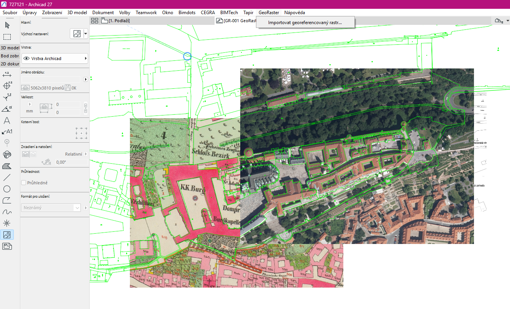

# GeoRaster

Native C++ Add-On for Archicad 27–29 that imports one north-up PNG or JPEG with a World File.



The **GeoRaster → Import georeferenced raster...** command supports:

- a new independent Worksheet, the active Worksheet or a selected existing Worksheet; rasters use
  their absolute World File coordinates;
- the active Floor Plan, using the inverse of Archicad's native Survey Point transformation.

> **Out of scope:** GeoRaster deliberately rejects World File rotation, shear, mirroring, zero
> scale, non-finite values and Floor Plan placements more than 10,000 m from Project Origin. TIFF,
> GeoTIFF, batch import, CRS reprojection and distributed builds are not part of this version, and
> there are currently no plans to implement them.

## Build

Requirements: Windows x64, Visual Studio 2022 with v142 and v143 toolsets, Git, uv and an Archicad installation for smoke testing.

```powershell
git clone --recurse-submodules https://github.com/vysmaty/archicad-georaster.git
cd archicad-georaster
uv sync --all-groups --locked
.\tools\bootstrap.ps1 -Version 29
.\tools\build.ps1 -Version 29 -Configuration Debug -Language CZE
```

The output is `build/.../GeoRaster.apx`. Every binary must be loaded only into the matching Archicad major.

## Repository layout

- `core/` — C++17 geometry, parsers and workflow code without Archicad API dependencies.
- `src/` — Add-On entry point, dialog, command and the `src/compat/` API boundary.
- `RCZE/`, `RINT/` — Czech and International resources; CZE is the default.
- `tests/cpp/` — framework-free CTest unit tests.
- `tests/` — Python structural repository contracts.
- `georaster.yaml` — supported versions and pinned upstreams.

Local and CI builds keep `AC_ADDON_FOR_DISTRIBUTION=OFF` and use development-only MDID `1/1`. See [developer ID notes](docs/developer-id.md) before any distribution work.

## Releases

Pushing a semantic-version tag creates a GitHub Release after the complete CI matrix succeeds. Tags
such as `v0.1.0` create a normal release; tags containing a suffix, such as `v0.1.1-alpha.1`, create
a prerelease. Each release contains CZE Release Add-Ons for Archicad 27, 28 and 29.

Licensed under Apache-2.0. Copyright 2026 vysmaty.
